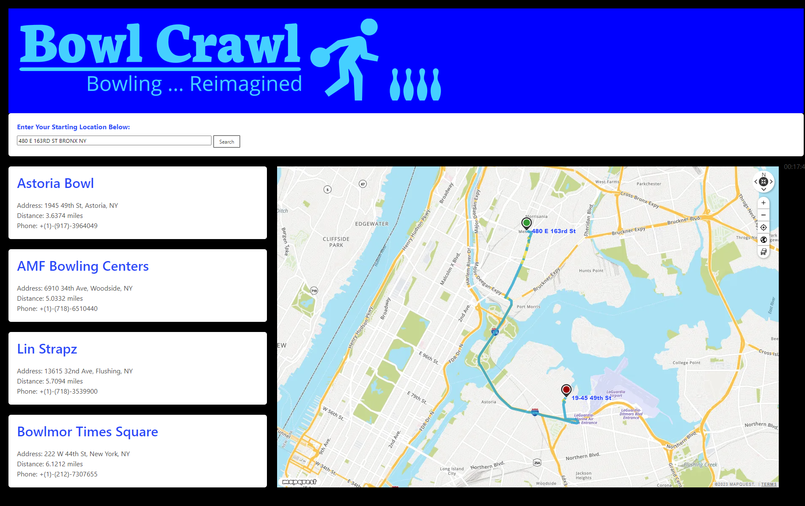

# Bowl Crawl

## Description
This application is a simple client-side application that allows the user to insert a location of their choosing and be provided with four different bowling locations with the name of the establishment, the address, the distance from the starting point, and the phone number. This project was made with group members to build an application using third-party APIs so that we could apply our new acquired skills to the test. We used team collaboration, agile development, storytelling, and project demonstration. 

## Installation:
<ul>
	<li>Download the Repository</li>
	<li>Open index.html in Visual Studio Code</li>
	<li>Open the Live Server or open using Visual Studio Code to the default browser of your choosing to use the application.</li>
</ul>

## Code Features: 
<ul>
	<li>Visual Studio Code</li>
	<li>HTML</li>
	<li>CSS</li>
	<li>JavaScript</li>
    <li>JQuery</li>
	<li>Bulma</li>
	<li>Mapquest SDK</li>
	<li>Directions API with both Routes and Route Shape API</li>
	<li>Search API</li>
</ul>

## Demo:

## Usage:
Access the website with [this link!](https://ryanmfloersch.github.io/BowlCrawl/)

Users will be able to open the application and insert a location of their choosing and be given four different options for a nearby bowling alley. They will be given the establishment name, the address, the distance from the starting point, and the phone number. 

Addresses that work with the search function can be written like "555 Bowl Street, City Name, NJ". Less descriptive starting locations like "Philadelphia, PA" or "Pennsylvania" also work. The search bar also stores previous searches!

Clicking on one of the four returned establishments will draw a route on the map, as well as write the time it will take to complete the drive to the right of the map.

## Credits: 
Floersch, Ryan. Guillaume, Kimberlie. Lewis, Austin. Rosenblue, Jeff. 

## Websites: 
Github: https://github.com/RyanmFloersch/BowlCrawl 
Deployed:  https://ryanmfloersch.github.io/BowlCrawl/ 
	
## License: 
Copyright © Floersch, Ryan. Guillaume, Kimberlie. Lewis, Austin. Rosenblue, Jeff. All rights reserved.  
Refer to the LICENSE under the Repository 
